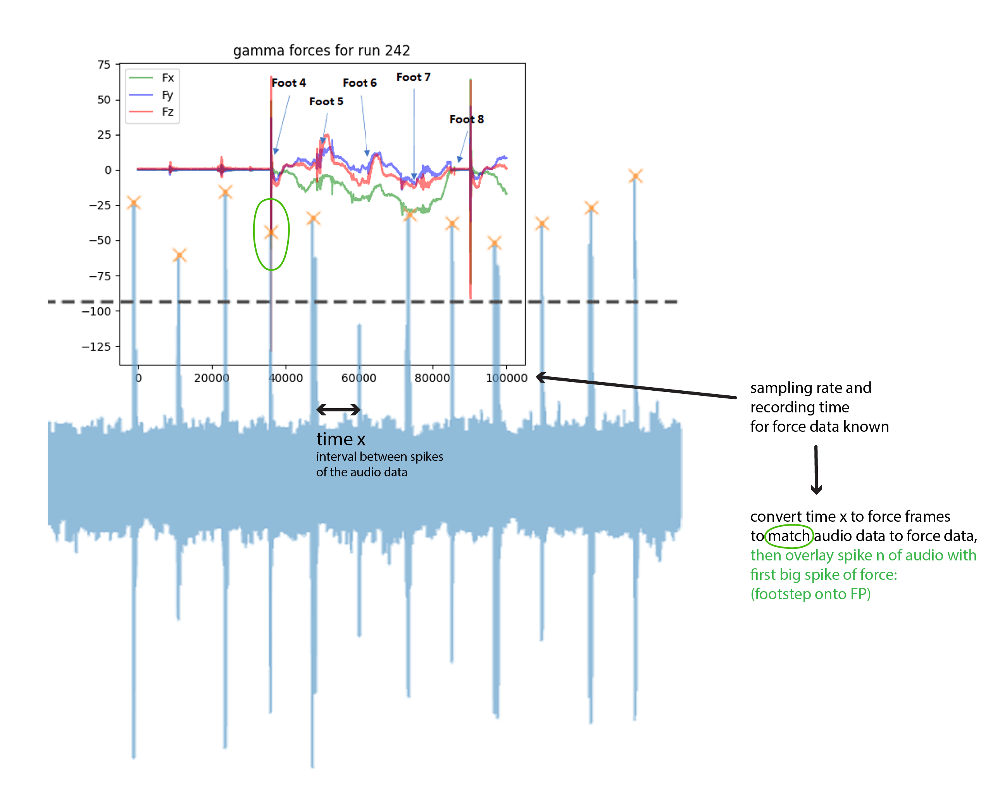
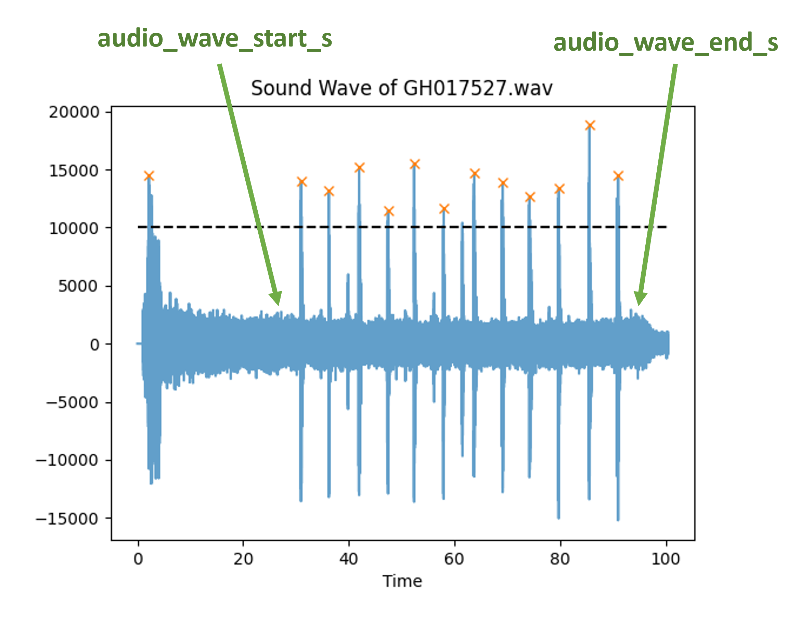
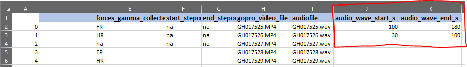
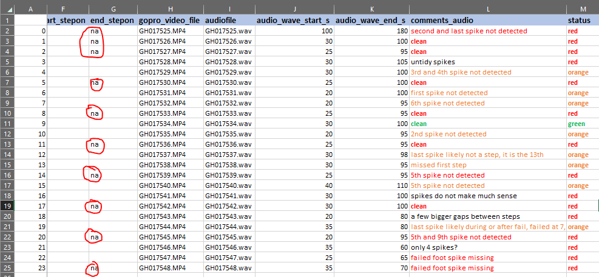
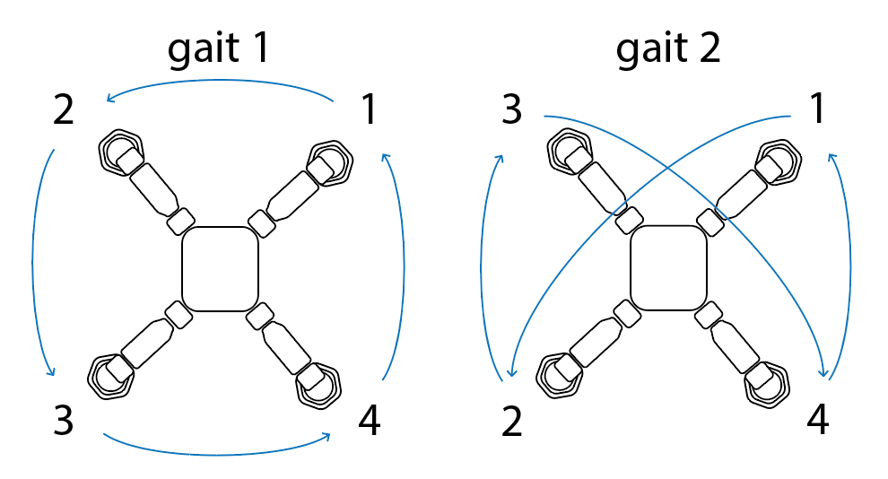

# force_analysis_python
force analysis for Magneto and Lizards

This progam enables the user to perform experimental data assembly for Magneto force trials and Lizard force trials (coming soon).

## Usage:
In the pycharm console or the virt env of the project:
```
>> import forceAnalysis
```
Then different commands can be executed:
## 1) Data assembly:
Within this module the data from the Magneto internal sensors are combined with the trial notes data, which include climbed distance etc.
***>Soon***: The forces collected with the gamma force plate can also be added to the combined data sheets if desired.

#### Note: date and subject are optional. If date is left blank, all data trials over all dates will be used. If subject is left blank, magneto will be used by default.
```
>> forceAnalysis.assemble(subject="magneto", date="YYYY-MM-DD")  # "magneto" or "lizards"
```
### For assemble(): 
- By default the data for **magneto** will be looked at. If instead data for lizards should be assembled, subject has to be changed to "lizards" (not yet functional) 
- The date refers to the date the trials were collected on. The dataCollectionTable_date.xlsx will be used for this trial date.

Inside assemble the data collection notes will be combined with the actual sensor results from Magnetos sensors.
The raw data is stored as .bag files and has to be converted to .csv before executing this script. The **bag_to_csv.py** script
does this. The sensor data of interest and the respective .bag file topics (or csv files) are defined within the code,
currently defined: IMU data, foot positions, internal force sensor data, voltage, current and power.

Magneto sensor data collected with different sample frequencies are aligned using the ROS time stamp. 

##### Output:
An "_assembled.csv" file will be created for each run with the combined sensor data of Magneto.
Further an "_assembled_meta.csv" file will be created which has the trial run info from the dataCollectionTable added to it.

## 2) Data summary:
This function combines the individual "_assembled_meta.csv" files for the selected date into a summary file. 
Means for the usually n=3 trials/configuration will be used.
- needs: The "_assembled_meta.csv" files

```
>> forceAnalysis.create_summary(date="YYYY-MM-DD") 
```

##### Output:
A summary file stored in python_force_analysis/result_files/YYYY-MM-DD/summary_data

## 3) Forces Gamma Magneto:
currently working on this...

## 4) Plot audio track of GoPro to detect steps Magneto:
To analyse the gamma force data properly, we need to know when Magneto moves the feet. Because Magneto
only moves 1 foot at any time, the foot on the force plate remains there while the 3 other feet do their step
before it is lifted off the force plate. 
Therefore, the idea is to plot the audio track of the GoPro to match the "clonk" spiked of the 
Magnet feet when attaching to the steel track with the force Data. Once the steps are matched to the force recording,
we can see what happens to the forces during each step. For the force Data we know
which foot attached to the force plate and in which step cycle as well as when the force measurement was stopped.
Sketch of idea:



```
>>> forceAnalysis.plot_gopro_audio(date, bool_plot_audio)
i.e.: >>> forceAnalysis.plot_gopro_audio("07-04-2021", False)
```

As a first step the gopro videos for the selected date are loaded and the audio track is exported 
as a separate .wav file with the same filename otherwise.
Then the .wav file is read in and plotted and then the spikes are detected using the "find_peaks" function
from scipy.signal library.
As a second step the module will then check if a "audio_wave_start_s" and "audio_wave_end_s" column are already existant in the respective 
**"{date}_gammaForces.csv"** sheet. If not user will be asked to add them in manually first (see below how to) before re-executing this 
command.

Because spikes of e.g. Magneto being put onto the steel track and being taken off might get detected as well,
to only use the "step spikes" the user has to use the plots of the audio tracks to manually add
a start and end column to the excel sheet **"{date}_gammaForces.csv"** as per below:
start and end frame don't have to be exact, in the example it could be start = 25, end = 95.



Further add a column "comments_audio" to note which audio tracks are "clean" and which ones might have some 
missing spikes because spike was below cut-off. Also note which tracks are untidy and not worth to include 
unless not enough data overall. Use these comments to add another column, which inidcates for the script the "status" 
of the trial and therefore what to do with it, when re-reading in the excel sheet:


### Status codes explained:
-  `Status Code: red`: status is "red":
  - if there is no foot on the FP (e.g. column start_stepon = na)
  - if the spikes are too untidy and extra post processing would take a while
-  `Status Code: orange`: status is "orange":
  - if nth spike was not detected because it was below the cut-off value "height" in the function arguments of find_peaks().
  Use the find_peaks function again only within the manually selected interval with a lower height to detect missing peaks 
-  `Status Code: green`: status is "green": 
  - if all 12 steps were detected and no other missing or false peaks were detected.

As a third step, the start and end markers are then read in again when executing the same command in the console.
Depending on the status code of the trial the audio track is treated in a different way.

The spikes and their respective frames are extracted as a dict for spikes in the given frame interval only.

## Magneto
The sensors in Magneto are orientated as follows:


In the data assembly files (for every run), "static" data (e.g. velocity, foot which sensor was mounted in, etc.) 
and the timestep wise collected data (e.g. forces, imu data or feet positions) are accumulated.

#### Magneto gait patterns:
The standard gait pattern for Magneto follows the order of gait1 - a cyclic pattern.
We have modified this gait pattern to follow a more lizard-like order, gait2 - a diagonal gait pattern, yet still only moving 1 foot at a time.



```
>> forceAnalysis.plot_forces(overwrite_plots=True)
>> forceAnalysis.plot_imu(overwrite_plots=True)
```