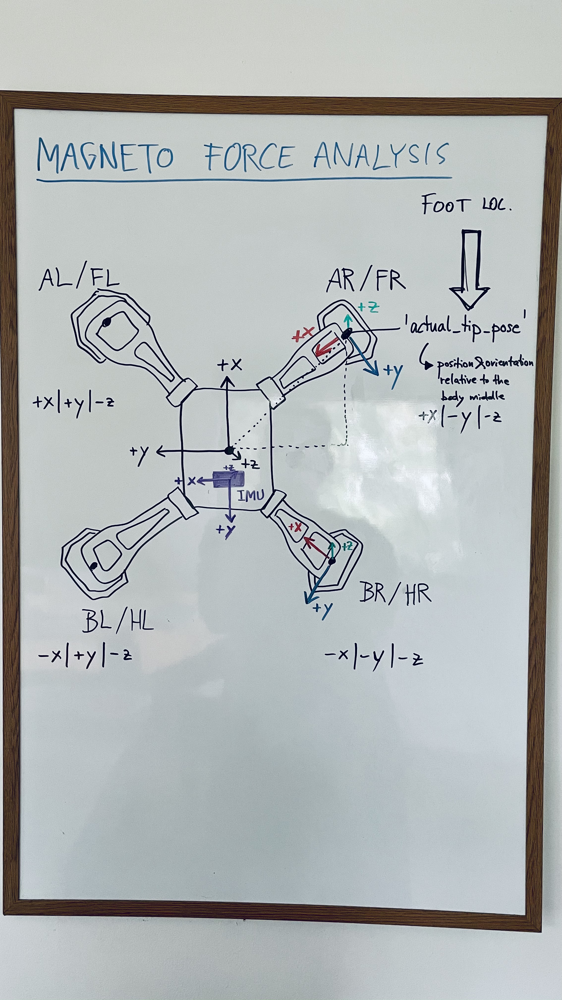

# force_analysis_python
force analysis for Magneto and Lizards

This progam enables the user to perform experimental data assembly for Magneto force trials and Lizard force trials (coming soon).

## Usage:
In the pycharm console or the virt env of the project:
```
>> import forceAnalysis
```
Then different commands can be executed:
```
>> forceAnalysis.assemble(subject="magneto", date="YYYY-MM-DD", overwrite_csv_files=True)  # "magneto" or "lizards"
>> forceAnalysis.plot_forces(overwrite_plots=True)
>> forceAnalysis.plot_imu(overwrite_plots=True)
```
### For assemble(): 
- If instead data for lizards should be assembled, subject has to be changed to "lizards" (not yet functional) 
- The date refers to the date the trials were collected on. This date also appears in the respective dataCollectionTable file, 
hence it has to match so that the collection notes can be read in properly.
  
Inside assemble the data collection notes will be combined with the actual sensor results from Magnetos sensors.
The raw data is stored as .bag files and has to be converted to .csv before executing this script. The bag_to_csv.py script
does this. The sensor data of interest and the respective .bag file topics (or csv files) are defined within the code.
Data collected with different sample frequencies will be aligned using the ROS time stamp. An "_assembled.csv" file will be 
created with the combined data. This will then be further summarized to a "_summarized.csv" file which contains the means 
for each tested configuration.

## Magneto
The sensors in Magneto are orientated as follows:


In the data assembly files (for every run), "static" data (e.g. velocity, foot which sensor was mounted in, etc.) 
and the timestep wise collected data (e.g. forces, imu data or feet positions) are accumulated.
