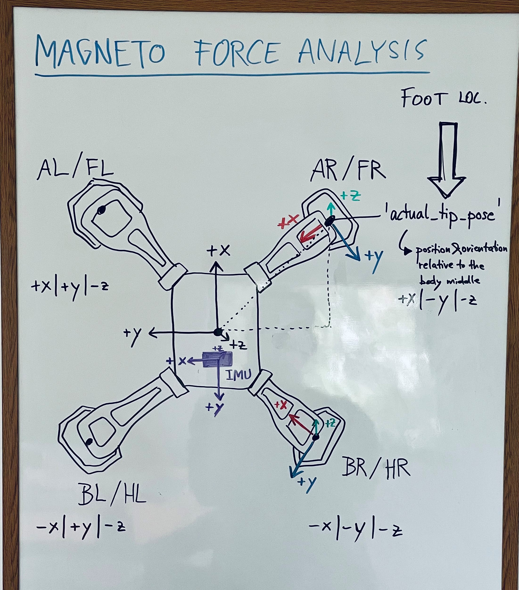

# force_analysis_python
force analysis for Magneto and Lizards

This progam enables the user to perform experimental data assembly for Magneto force trials and Lizard force trials (coming soon).

## Usage:
In the pycharm console or the virt env of the project:
```
>> import forceAnalysis
```
Then different commands can be executed:
```
>> forceAnalysis.assemble(subject="magneto", overwrite_csv_files=True)
>> forceAnalysis.plot_forces(overwrite_plots=True)
>> forceAnalysis.plot_imu(overwrite_plots=True)
```
If instead data for lizards should be assembled, subject has to be changed to "lizards" (not yet functional) 

## Magneto
The sensors in Magneto are orientated as follows:


In the data assembly files (for every run), "static" data (e.g. velocity, foot which sensor was mounted in, etc.) 
and the timestep wise collected data (e.g. forces, imu data or feet positions) are accumulated.
